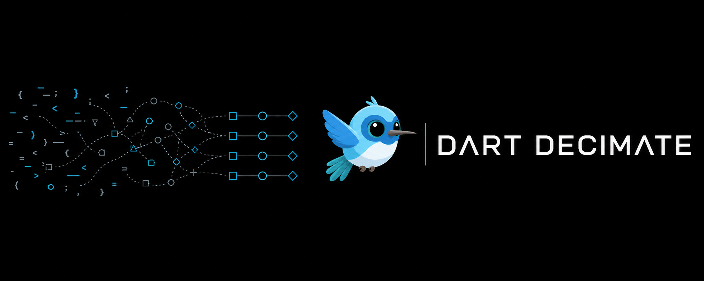

# Dart Decimate



Find dead Dart code, circular dependencies, duplicated code, complex functions,
dependency problems, risky Flutter wiring, and PR risk fast.


Dart Decimate is a Rust-native codebase intelligence tool for Dart and Flutter. It
looks at your repo as a graph:

- Dart files are nodes.
- `import`, `export`, `part`, `part of`, and `library augment` are edges.
- The report tells you what is unused, risky, duplicated, tangled, or hard to
  maintain.

It is not a formatter. It is not a replacement for `dart analyze`. It is not a
Flutter style guide. It does not enforce opinions like "all providers must use
Riverpod code generation."

It answers practical questions:

- What code can probably be deleted?
- What files depend on each other in a circle?
- What functions are too complex?
- What code was copied around?
- What dependency is unused or missing from `pubspec.yaml`?
- What changed code is risky before a PR lands?
- What should an AI coding agent inspect before making a fix?

## Start Here

Inside any Dart or Flutter project, run this:

```bash
npx --yes dart-decimate check . --format json --summary
```

That is the easiest command. It checks the whole repo for dead code, circular
dependencies, duplicated code, complex functions, dependency hygiene,
architecture drift, Flutter graph issues, security candidates, and PR-risk
signals.

For a shorter human-readable report:

```bash
npx --yes dart-decimate check .
```

If the report says `"verdict": "fail"`, Dart Decimate worked. It means it found
error-level issues. It does not mean the tool crashed.

Exit codes:

- `0`: no error-level findings
- `1`: Dart Decimate found issues
- `2`: command, config, or runtime error
- `8`: security gate found new review-required candidates

## Install

You do not need to install anything permanently. Use `npx`:

```bash
npx --yes dart-decimate check . --format json --summary
```

Add this to `package.json` if you want a short project command:

```json
{
  "scripts": {
    "dart-decimate": "dart-decimate check . --format json --summary"
  },
  "devDependencies": {
    "dart-decimate": "^0.0.3"
  }
}
```

Then run:

```bash
npm run dart-decimate
```

If you prefer Cargo:

```bash
cargo install --git https://github.com/sgaabdu4/dart-decimate
```

Cargo installs `dart-decimate` and `dart-decimate-mcp` into `~/.cargo/bin`.

Fish:

```bash
fish_add_path ~/.cargo/bin
```

Bash or Zsh:

```bash
export PATH="$HOME/.cargo/bin:$PATH"
```

From a local checkout:

```bash
git clone https://github.com/sgaabdu4/dart-decimate.git
cd dart-decimate
cargo install --path . --force
```

Then run it in your app:

```bash
cd /path/to/flutter_or_dart_repo
dart-decimate check . --format json
```

## npx

The npm package name is `dart-decimate`. These commands do not require a global
install.

Check everything:

```bash
npx --yes dart-decimate check . --format json --summary
```

Human-readable output:

```bash
npx --yes dart-decimate check .
```

To run the GitHub version directly:

```bash
npx --yes --package github:sgaabdu4/dart-decimate dart-decimate check . --format json
```

## What Dart Decimate Looks For

### 1. Dead Code

Dead code is code that is not reachable from your entry points.

Dart Decimate finds:

- dead Dart files
- unused public exports
- unused type aliases
- unused enum values
- unused private class members
- unrendered Flutter widgets
- missing entry points
- stale `dart-decimate-ignore` comments

Useful commands:

```bash
dart-decimate dead-code . --entry lib/main.dart --format json
dart-decimate check . --unused-files --unused-exports --unused-deps --format json
```

### 2. Complex Code

Cyclomatic complexity means "how many paths can this function take?"

Cognitive complexity means "how hard is this function to understand?"

CRAP score combines complexity with test coverage. A complex function with poor
coverage gets a worse score.

Dart Decimate finds:

- high cyclomatic complexity
- high cognitive complexity
- high combined complexity
- high CRAP score
- coverage gaps
- low health score files
- hotspots
- refactoring targets

Useful commands:

```bash
dart-decimate health . --format json
dart-decimate health . --complexity-breakdown --top 10 --format json
dart-decimate health . --file-scores --hotspots --targets --format json
```

### 3. Duplicated Code

Duplication means the same Dart code appears in more than one place.

Dart Decimate finds exact and semantic clone groups. Each clone group gets a stable
fingerprint like `dup:abc12345`, so agents can trace it before touching code.

Useful commands:

```bash
dart-decimate dupes . --format json
dart-decimate dupes . --mode semantic --min-lines 5 --format json
dart-decimate dupes . --threshold 5 --format json
dart-decimate trace-clone . --fingerprint dup:abc12345 --format json
```

### 4. Circular Dependencies

A circular dependency means file A depends on file B, and B eventually depends
back on A. Cycles make code harder to move, test, and delete.

Dart Decimate finds:

- circular dependencies
- re-export cycles
- import/export/part/augment targets that do not resolve
- invalid `part` / `part of` relationships

Useful commands:

```bash
dart-decimate cycles . --format json
dart-decimate check . --circular-deps --re-export-cycles --format json
```

### 5. Architecture Drift

Architecture drift means code crosses boundaries it should not cross.

Example: `lib/domain/` depending on `lib/ui/`.

Dart Decimate finds:

- boundary violations
- files outside configured boundary zones
- forbidden direct calls across boundaries
- policy-pack violations for banned imports, exports, and calls

Useful command:

```bash
dart-decimate check . \
  --boundary lib/domain:lib/ui \
  --boundary-coverage \
  --format json
```

### 6. Dependency Hygiene

Dependency hygiene means your imports and `pubspec.yaml` agree.

Dart Decimate finds:

- unused runtime dependencies
- unused dev dependencies
- runtime dependencies used only by tests
- imports missing from `pubspec.yaml`
- unused dependency overrides
- invalid dependency overrides
- imports into another package's private `lib/src`
- duplicate public API exports

Useful commands:

```bash
dart-decimate trace-dependency . --dependency collection --format json
dart-decimate check . --unused-deps --unlisted-deps --private-src-imports --format json
```

### 7. Flutter-Specific Graph Issues

Dart Decimate does not care which state-management style you use. It uses Flutter
and Dart patterns only to avoid false positives and to find graph problems.

Dart Decimate finds:

- GoRouter route path/name collisions
- private Flutter widget classes
- top-level widget helper functions
- unused widget constructor parameters
- widget classes that are never constructed
- missing `context.mounted` guards after awaited widget work

### 8. Security Candidates

These are review prompts, not proof of an exploit.

Dart Decimate finds candidates for:

- hardcoded secrets
- insecure HTTP transport
- TLS validation bypasses
- risky WebView settings
- process execution
- raw SQL
- plain local storage of secret-like material

Useful commands:

```bash
dart-decimate security . --surface --format json
dart-decimate security . --ci --sarif-file dart-decimate-security.sarif
git diff --cached --unified=0 | dart-decimate security . --gate new --diff-stdin --format json
```

### 9. PR Risk

Use this before merging changed code.

Dart Decimate reports:

- risk score
- pass / warn / fail risk level
- findings introduced by the PR
- findings that already existed
- risky changed files

Useful commands:

```bash
dart-decimate audit . --base origin/main --format json
dart-decimate audit . --base origin/main --gate new-only --format json
```

### 10. Runtime Intelligence

Static analysis says what is connected. Runtime coverage says what actually ran.

Dart Decimate can read LCOV, V8, and Istanbul coverage data.

Useful commands:

```bash
dart-decimate health . --coverage coverage/lcov.info --coverage-gaps --max-crap 30 --format json
dart-decimate coverage analyze . --runtime-coverage coverage-final.json --format json
```

## How To Read The Summary

Example:

```json
{
  "files": 466,
  "edges": 1231,
  "quality_score": 93,
  "cycles": 2,
  "code_duplications": 26,
  "complex_functions": 13,
  "dead_files": 11,
  "findings": 125
}
```

Plain English:

- `files`: Dart files Dart Decimate parsed
- `edges`: imports, exports, parts, and augments it resolved
- `quality_score`: project health from `0` to `100`
- `cycles`: circular dependency groups
- `code_duplications`: duplicated code groups
- `complex_functions`: functions over the complexity limits
- `dead_files`: files Dart Decimate thinks are unreachable
- `findings`: total issues in the report

## JSON For Agents

Use JSON when another tool or AI agent will read the result:

```bash
dart-decimate check . --format json
```

Every finding includes:

- `rule_id`
- `kind`
- `severity`
- `path`
- `line`
- `column`
- `safe_to_delete`
- related `files`
- suggested `actions`

Example shape:

```json
{
  "schema_version": "dart-decimate.report.v1",
  "kind": "combined",
  "tool": "dart-decimate",
  "command": "check",
  "verdict": "fail",
  "summary": {
    "files": 466,
    "edges": 1231,
    "quality_score": 93,
    "findings": 125
  },
  "findings": [],
  "next_steps": []
}
```

If a JSON command fails before a report can be built, stdout still stays
machine-readable:

```json
{ "error": true, "message": "coverage analyze requires --runtime-coverage PATH", "exit_code": 2 }
```

## Fixes

Preview safe fixes:

```bash
dart-decimate fix . --format json
```

Apply confirmed safe fixes:

```bash
dart-decimate fix . --apply --confirm --format json
```

Safe fixes are intentionally conservative. Dart Decimate can currently apply:

- simple dead-file deletion
- stale suppression removal
- one-line unused Pub dependency removal
- one-line unused top-level Dart declaration removal

Everything else stays review-only.

## Watch Mode

Rerun checks while you work:

```bash
dart-decimate watch . --no-clear
```

Run once and exit, useful for scripts:

```bash
dart-decimate watch . --once --format json
```

## MCP

Start the MCP server:

```bash
dart-decimate-mcp
```

Agents can use it to inspect a project, trace files, trace symbols, inspect
duplicates, review PR risk, read runtime coverage slices, preview fixes, and
ask what is safest to do next.

`fix_apply` is the only mutating MCP tool and requires explicit `yes: true`.

## Config

Dart Decimate reads config from:

1. `.dart-decimaterc`
2. `.dart-decimaterc.json`
3. `.dart-decimaterc.jsonc`
4. `dart-decimate.toml`
5. `.dart-decimate.toml`

Example:

```toml
[cli]
format = "json"
entry = ["lib/main.dart"]
production = true

[health]
max_cyclomatic = 20
max_cognitive = 15
coverage_gaps = true
fileScores = true
hotspots = true
targets = true

[dupes]
mode = "semantic"
min_tokens = 80
threshold = 5

[boundaries]
presets = ["layered"]
rules = ["lib/domain:lib/ui"]

[security]
surface = true
categories = ["hardcoded-secret", "insecure-transport", "tls-bypass"]

[rules]
unused-files = "error"
unused-exports = "warn"
security-candidate = "warn"
```

## Full Issue List

Run this for the live list:

```bash
dart-decimate schema --format json | jq .issue_types
```

Current issue types:

```text
dead-file
unused-export
unused-type
private-type-leak
unused-enum-member
unused-class-member
duplicate-export
route-collision
private-widget-class
widget-top-level-function-boundary
unused-widget-param
unrendered-widget
missing-context-mounted-after-await
missing-entry-point
circular-dependency
re-export-cycle
boundary-violation
boundary-coverage
boundary-call-violation
policy-violation
unresolved-dependency
part-of-violation
unused-dependency
unused-dev-dependency
test-only-dependency
unused-dependency-override
misconfigured-dependency-override
unlisted-dependency
private-src-import
code-duplication
high-cyclomatic-complexity
high-cognitive-complexity
high-complexity
coverage-gap
high-crap-score
health-hotspot
refactoring-target
feature-flag
security-candidate
stale-suppression
missing-suppression-reason
```

## CI

Add Dart Decimate to CI so every PR gets the same repo health check:

```yaml
- name: Dart Decimate
  run: npx --yes dart-decimate check . --format json --summary
```

That is the easiest CI command. It checks everything Dart Decimate knows how to
check in one pass.

For PR-only regression checks, use:

```bash
npx --yes dart-decimate audit . --base origin/main --format json --summary --gate new-only
```

You can also put the full check in a git hook:

```bash
mkdir -p .git/hooks
cat > .git/hooks/pre-commit <<'SH'
#!/usr/bin/env sh
npx --yes dart-decimate check . --format json --summary
SH
chmod +x .git/hooks/pre-commit
```

This repository already runs:

- Rust format, clippy, and tests
- npm package checks
- version sync between `Cargo.toml` and `package.json`
- a release-version gate so published versions cannot be reused
- migration checks that block previous package, command, schema, and MCP names
- Dependabot and weekly dependency/security audits

Generate CI templates:

```bash
dart-decimate ci-template github --format yaml
dart-decimate ci-template gitlab --format yaml
```

Preview review-thread reconciliation without changing GitHub or GitLab:

```bash
dart-decimate ci reconcile-review \
  --provider github \
  --repo owner/repo \
  --pr 123 \
  --envelope review-github.json \
  --dry-run \
  --format json
```

## Scope

Dart Decimate implements local Fallow-style codebase intelligence for Dart and
Flutter.

Fallow features that are JS-specific or require hosted backends return clear
unsupported JSON instead of pretending to work:

```bash
dart-decimate migrate --dry-run --format json
dart-decimate telemetry status --format json
dart-decimate license status --format json
```

## Development

```bash
cargo fmt --check
cargo clippy --all-targets -- -D warnings
cargo test --all-targets
npm run version:check
npm run release:check
npm run migration:check
npm run pack:check
```

This repository forbids `unsafe_code`.

## Release Flow

Current version: `0.0.3`.

After the first public release, changes should go through pull requests.

To release a new version:

1. Update both `Cargo.toml` and `package.json`.
2. Open a PR.
3. Let CI pass.
4. Merge to `main`.
5. GitHub Actions publishes `dart-decimate` to npm, creates tag `vX.Y.Z`, and
   creates the GitHub release.

Local hooks block stale package names, mismatched versions, reused npm versions,
and direct pushes to `main`.

## License

Licensed under the MIT License. See [LICENSE](LICENSE).
